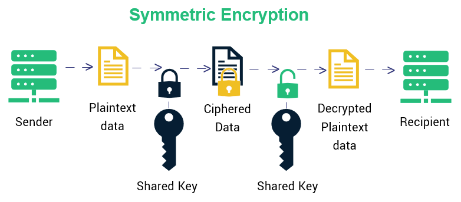
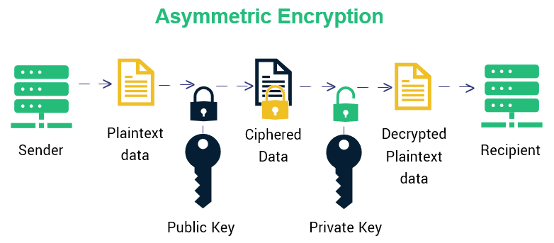
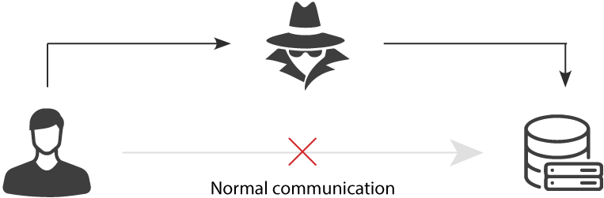

### 什么是对称加密?
简单说就是有一个密钥，它可以加密一段信息，也可以对加密后的信息进行解密。

### 用对称加密可行吗？
如果通信双方都各自持有同一个密钥，且没有别人知道，这两方的通信安全当然是可以被保证的（除非密钥被破解）。

然而最大的问题就是这个密钥怎么让传输的双方知晓，同时不被别人知道。你会发现不管怎么商定，浏览器和网站的首次通信过程必定是明文的。这就意味着，按照上述的工作流程，我们始终无法创建一个安全的对称加密密钥。

所以，只使用对称加密看来是永远无法解决这个问题了。

### 什么是非对称加密?
简单说就是有两把密钥，通常一把叫做公钥、一把叫私钥，用公钥加密的内容必须用私钥才能解开，同样，私钥加密的内容只有公钥能解开。

### 用非对称加密可行吗？
鉴于非对称加密的机制，我们可能会有这种思路：服务器先把公钥以明文方式传输给浏览器，之后浏览器向服务器传数据前都先用这个公钥加密好再传，这条数据的安全似乎可以保障了！因为只有服务器有相应的私钥能解开公钥加密的数据。

然而反过来由服务器到浏览器的这条路怎么保障安全？如果服务器用它的私钥加密数据传给浏览器，那么浏览器用公钥可以解密它，而这个公钥是一开始通过明文传输给浏览器的，若这个公钥被中间人劫持到了，那他也能用该公钥解密服务器传来的信息了。所以目前似乎只能保证由浏览器向服务器传输数据的安全性（其实仍有漏洞，下文会说），那利用这点你能想到什么解决方案吗？

### 改良的非对称加密方案，似乎可以？
我们已经理解通过一组公钥私钥，可以保证单个方向传输的安全性，那用两组公钥私钥，是否就能保证双向传输都安全了？请看下面的过程：

某网站服务器拥有公钥A与对应的私钥A’；浏览器拥有公钥B与对应的私钥B’。
浏览器把公钥B明文传输给服务器。
服务器把公钥A明文给传输浏览器。
之后浏览器向服务器传输的内容都用公钥A加密，服务器收到后用私钥A’解密。由于只有服务器拥有私钥A’，所以能保证这条数据的安全。
同理，服务器向浏览器传输的内容都用公钥B加密，浏览器收到后用私钥B’解密。同上也可以保证这条数据的安全。
的确可以！抛开这里面仍有的漏洞不谈（下文会讲），HTTPS的加密却没使用这种方案，为什么？很重要的原因是非对称加密算法非常耗时，而对称加密快很多。那我们能不能运用非对称加密的特性解决前面提到的对称加密的漏洞？

### 非对称加密+对称加密？
既然非对称加密耗时，那非对称加密+对称加密结合可以吗？而且得尽量减少非对称加密的次数。当然是可以的，且非对称加密、解密各只需用一次即可。
请看一下这个过程：

某网站拥有用于非对称加密的公钥A、私钥A’。
浏览器向网站服务器请求，服务器把公钥A明文给传输浏览器。
浏览器随机生成一个用于对称加密的密钥X，用公钥A加密后传给服务器。
服务器拿到后用私钥A’解密得到密钥X。
这样双方就都拥有密钥X了，且别人无法知道它。之后双方所有数据都通过密钥X加密解密即可。
完美！HTTPS基本就是采用了这种方案。完美？还是有漏洞的。

### 中间人攻击

如果在数据传输过程中，中间人劫持到了数据，此时他的确无法得到浏览器生成的密钥X，这个密钥本身被公钥A加密了，只有服务器才有私钥A’解开它，然而中间人却完全不需要拿到私钥A’就能干坏事了。请看：

某网站有用于非对称加密的公钥A、私钥A’。
浏览器向网站服务器请求，服务器把公钥A明文给传输浏览器。
中间人劫持到公钥A，保存下来，把数据包中的公钥A替换成自己伪造的公钥B（它当然也拥有公钥B对应的私钥B’）。
浏览器生成一个用于对称加密的密钥X，用公钥B（浏览器无法得知公钥被替换了）加密后传给服务器。
中间人劫持后用私钥B’解密得到密钥X，再用公钥A加密后传给服务器。
服务器拿到后用私钥A’解密得到密钥X。
这样在双方都不会发现异常的情况下，中间人通过一套“狸猫换太子”的操作，掉包了服务器传来的公钥，进而得到了密钥X。根本原因是浏览器无法确认收到的公钥是不是网站自己的，因为公钥本身是明文传输的，难道还得对公钥的传输进行加密？这似乎变成鸡生蛋、蛋生鸡的问题了。解法是什么？

### 如何证明浏览器收到的公钥一定是该网站的公钥？
其实所有证明的源头都是一条或多条不证自明的“公理”（可以回想一下数学上公理），由它推导出一切。比如现实生活中，若想证明某身份证号一定是小明的，可以看他身份证，而身份证是由政府作证的，这里的“公理”就是“政府机构可信”，这也是社会正常运作的前提。

那能不能类似地有个机构充当互联网世界的“公理”呢？让它作为一切证明的源头，给网站颁发一个“身份证”？

它就是CA机构，它是如今互联网世界正常运作的前提，而CA机构颁发的“身份证”就是数字证书。

### 中间人有可能篡改该证书吗？
假设中间人篡改了证书的原文，由于他没有CA机构的私钥，所以无法得到此时加密后签名，无法相应地篡改签名。浏览器收到该证书后会发现原文和签名解密后的值不一致，则说明证书已被篡改，证书不可信，从而终止向服务器传输信息，防止信息泄露给中间人。

既然不可能篡改，那整个证书被掉包呢？

### 中间人有可能把证书掉包吗？
假设有另一个网站B也拿到了CA机构认证的证书，它想劫持网站A的信息。于是它成为中间人拦截到了A传给浏览器的证书，然后替换成自己的证书，传给浏览器，之后浏览器就会错误地拿到B的证书里的公钥了，这确实会导致上文“中间人攻击”那里提到的漏洞？

其实这并不会发生，因为证书里包含了网站A的信息，包括域名，浏览器把证书里的域名与自己请求的域名比对一下就知道有没有被掉包了。

### 每次进行HTTPS请求时都必须在SSL/TLS层进行握手传输密钥吗？
这也是我当时的困惑之一，显然每次请求都经历一次密钥传输过程非常耗时，那怎么达到只传输一次呢？

服务器会为每个浏览器（或客户端软件）维护一个session ID，在TLS握手阶段传给浏览器，浏览器生成好密钥传给服务器后，服务器会把该密钥存到相应的session ID下，之后浏览器每次请求都会携带session ID，服务器会根据session ID找到相应的密钥并进行解密加密操作，这样就不必要每次重新制作、传输密钥了！

ps: 针对一些抓包工具抓到的https请求是明文的原因: 抓包工具的原理类似中间人攻击，安装抓包工具的ca证书到计算机即可替换服务器端证书从而拿到明文内容。

为什么不能只用对称加码？ 无法保证密钥安全传输
为什么不能只用非对称加密？ 两组公私钥可以实现，但非对称加密相比对称加密非常耗时
为什么要用对称加密+非对称加密？ 利用非对称加密解决对称加密的漏洞(无法保证密钥安全传输)
为什么需要引入ca证书相关？ 防止中间人攻击，篡改或者调包服务器端证书。