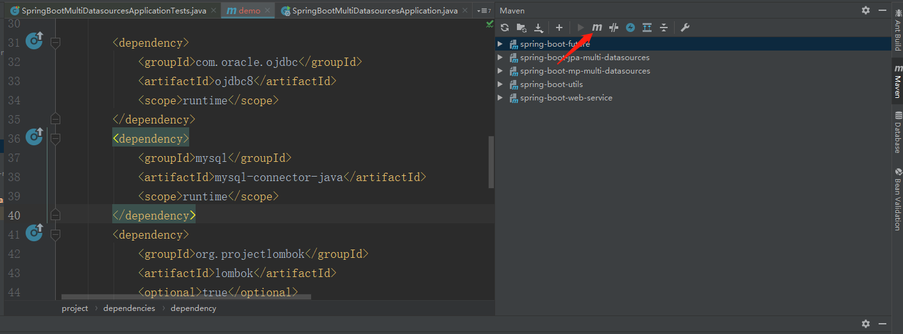
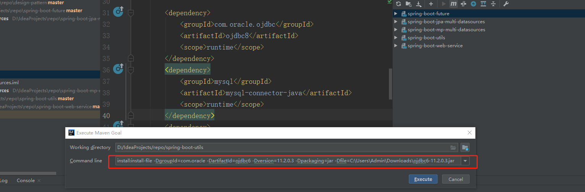

### Execute Maven Goal


### 执行mvn命令



```text
install:install-file -DgroupId=groupId -DartifactId=artifactId -Dversion=version -Dpackaging=jar -Dfile=jar path

eg: install:install-file -DgroupId=com.oracle -DartifactId=ojdbc6 -Dversion=11.2.0.3 -Dpackaging=jar -Dfile=C:\Users\Admin\Downloads\ojdbc6-11.2.0.3.jar
```