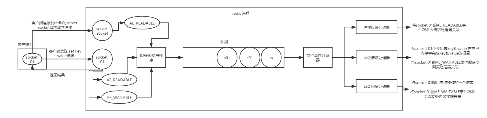
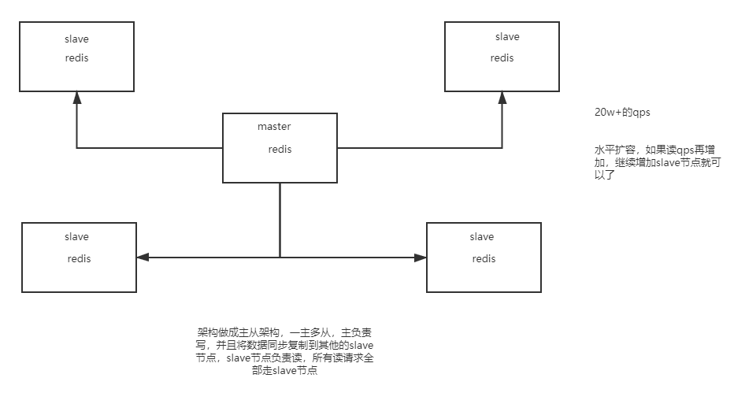

#### 在项目中缓存如何使用的？

将一些不经常变，经常使用的数据缓存起来。提高数据的访问性能

#### 为啥在项目里要用缓存？

高性能&高并发

#### 用了缓存以后会有什么不良的后果？

1. 缓存和数据库数据不一致
2. 缓存雪崩
3. 缓存穿透
4. 缓存并发竞争

#### redis和memcached有什么区别？

1. redis支持的数据结构比memcached多，可以进行复杂操作
2. redis支持原生的cluster模式而memcached不支持

#### redis的线程模型是什么？

#### 为什么单线程的redis比多线程的memcached效率要高的多？(为什么redis是单线程还可以支撑高并发)

1. 纯内存操作(文件事件分派器)
2. 核心是基于非阻塞的io多路复用机制
3. 单线程反而避免了多线程的频繁上下文切换问题

#### redis都有哪些数据类型？分别在哪些场景下使用比较合适？

1. string
2. hash(存对象)
3. list(简单分页lrange)
4. set(多个机器全局去重)
5. sorted set(自定义排序规则)

#### redis过期策略？(redis key过期了还占用内存？)

定期删除: 每隔一段时间随机检查一些key是否过期，过期就删除

&

惰性删除: 查询key的时候，查询key是否过期，过期就删除

上述保证了，过期的key是查询不出来的

#### 如果大量key堆积在内存里，导致redis内存耗尽怎么办？内存淘汰机制有哪些？

如果redis的内存占用过多的时候，此时会走redis的内存淘汰机制，有如下策略：

1. noeviction: 当内存不足以容纳写入新数据时，新写入操作会报错
2. allkeys-lru: 当内存不足以容纳写入新数据时，在键空间中，移除最近最少使用的key
3. allkeys-random: 当内存不足以容纳写入新数据时，在键空间中，随机移除某个key
4. volatile-lru: 当内存不足以容纳写入新数据时，在设置了过期时间的键空间中，移除最近最少使用的key
5. volatile-random: 当内存不足以容纳写入新数据是，在设置了过期时间的键空间中，随机移除某个key
6. volatile-ttl: 当内存不足以容纳写入新数据时，在设置了过期时间的键空间中，有更早过期时间的key优先移除

#### redis不能支撑高并发的瓶颈在哪里？

单机

#### 如果redis要支撑超过10w+的并发，那应该怎么做？

读写分离

#### redis replication的核心机制

1. redis采用异步方式复制数据到slave节点，不过redis 2.8开始，slave node会周期性地确认自己每次复制的数据量
2. 一个master node是可以配置多个slave node
3. slave node也可以连接其他的slave node
4. slave node做复制的时候，是不会block master node的正常工作的
5. slave node在做复制的时候，也不会block对自己的查询操作，它会用旧的数据集来提供服务；但是复制完成的时候，需要删除旧数据集，加载新数据集，这个时候就会暂停对外服务了
6. slave node主要用来横向扩容，做读写分离，扩容的slave node可以提高读的吞吐量

#### master持久化对于主从架构的安全保障的意义

如果采用了主从架构，那么建议必须开启master node的持久化

不建议用slave node作为master node的数据热备 因为那样的话 如果你关掉master的持久化，可能在master宕机重启的时候数据是空的，然后可能一经过复制，slave node数据也丢了

master -> RDB和AOF都关闭了 -> 全部在内存中

master宕机，重启，是没有本地数据可以恢复，然后就会直接认为自己IDE数据是空的

master就会将空的数据集同步到slave上去，所有slave的数据全部清空

master节点，必须要使用持久化机制

第二个，master的各种备份方案 ，万一说本地的所有文件丢失了 从备份中挑选一份rdb去恢复master； 这样才能确保master启动的时候 是有数据的

即使采用了后续讲解的高可用机制 slave node可以自动接管master node，但是也可能sentinal还没有检测到master failure，master node就自动重启了，还是可能导致上面的所有的slave node 数据清空故障