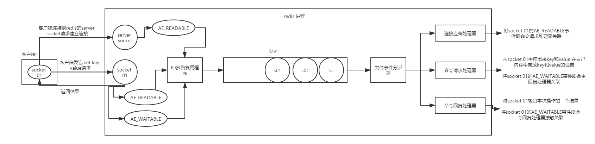
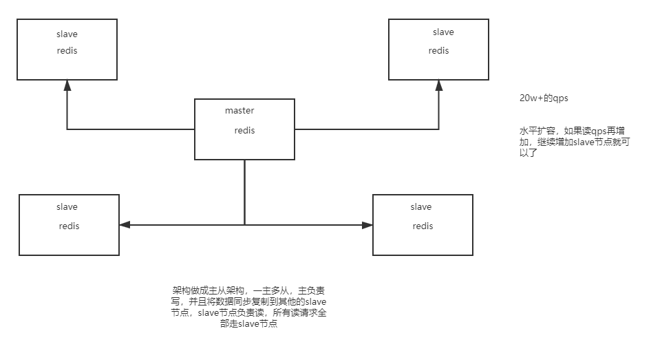

### redis 是什么？都有哪些使用场景？
是一个高性能的(key/value)分布式内存数据库。

#### 使用场景
- 热点数据的缓存
- 分布式锁
- 计数器
- 限时业务的运用

### redis 有哪些功能？

### redis 为什么是单线程的？
redis 核心就是 如果我的数据全都在内存里，我单线程的去操作 就是效率最高的，为什么呢，因为多线程的本质就是 CPU 模拟出来多个线程的情况，这种模拟出来的情况就有一个代价，就是上下文的切换，对于一个内存的系统来说，它没有上下文的切换就是效率最高的

### 什么是缓存穿透？怎么解决？

### redis 支持的 java 客户端都有哪些？
Redisson,Jedis，lettuce等等，官方推荐使用Redisson。

### jedis 和 redisson 有哪些区别？
Jedis 和 Redisson 都是Java中对Redis操作的封装。Jedis 只是简单的封装了 Redis 的API库，可以看作是Redis客户端，它的方法和Redis 的命令很类似。Redisson 不仅封装了 redis ，还封装了对更多数据结构的支持，以及锁等功能，相比于Jedis 更加大。但Jedis相比于Redisson 更原生一些，更灵活。

### 怎么保证缓存和数据库数据的一致性？
- 对删除缓存进行重试，数据的一致性要求越高，我越是重试得快。

- 定期全量更新，简单地说，就是我定期把缓存全部清掉，然后再全量加载。

- 给所有的缓存一个失效期。

### redis 持久化有几种方式？
RDB和AOF

### redis 怎么实现分布式锁？

### redis 分布式锁有什么缺陷？
Redis 分布式锁不能解决超时的问题，分布式锁有一个超时时间，程序的执行如果超出了锁的超时时间就会出现问题。     
     
### redis 如何做内存优化？

### redis 淘汰策略有哪些？

### redis 常见的性能问题有哪些？该如何解决？

### redis的线程模型是什么？

### redis都有哪些数据类型？分别在哪些场景下使用比较合适？

1. string
2. hash(存对象)
3. list(简单分页lrange)
4. set(多个机器全局去重)
5. sorted set(自定义排序规则)

### redis过期策略？(redis key过期了还占用内存？)

定期删除: 每隔一段时间随机检查一些key是否过期，过期就删除

&

惰性删除: 查询key的时候，查询key是否过期，过期就删除

### 如果大量key堆积在内存里，导致redis内存耗尽怎么办？内存淘汰机制有哪些？

如果redis的内存占用过多的时候，此时会走redis的内存淘汰机制，有如下策略：

1. noeviction: 当内存不足以容纳写入新数据时，新写入操作会报错
2. allkeys-lru: 当内存不足以容纳写入新数据时，在键空间中，移除最近最少使用的key
3. allkeys-random: 当内存不足以容纳写入新数据时，在键空间中，随机移除某个key
4. volatile-lru: 当内存不足以容纳写入新数据时，在设置了过期时间的键空间中，移除最近最少使用的key
5. volatile-random: 当内存不足以容纳写入新数据是，在设置了过期时间的键空间中，随机移除某个key
6. volatile-ttl: 当内存不足以容纳写入新数据时，在设置了过期时间的键空间中，有更早过期时间的key优先移除

### redis不能支撑高并发的瓶颈在哪里？

单机

### 如果redis要支撑超过10w+的并发，那应该怎么做？

读写分离

### redis replication的核心机制

1. redis采用异步方式复制数据到slave节点，不过redis 2.8开始，slave node会周期性地确认自己每次复制的数据量
2. 一个master node是可以配置多个slave node
3. slave node也可以连接其他的slave node
4. slave node做复制的时候，是不会block master node的正常工作的
5. slave node在做复制的时候，也不会block对自己的查询操作，它会用旧的数据集来提供服务；但是复制完成的时候，需要删除旧数据集，加载新数据集，这个时候就会暂停对外服务了
6. slave node主要用来横向扩容，做读写分离，扩容的slave node可以提高读的吞吐量

### master持久化对于主从架构的安全保障的意义

如果采用了主从架构，那么建议必须开启master node的持久化

不建议用slave node作为master node的数据热备 因为那样的话 如果你关掉master的持久化，可能在master宕机重启的时候数据是空的，然后可能一经过复制，slave node数据也丢了

master -> RDB和AOF都关闭了 -> 全部在内存中

master宕机，重启，是没有本地数据可以恢复，然后就会直接认为自己IDE数据是空的

master就会将空的数据集同步到slave上去，所有slave的数据全部清空

master节点，必须要使用持久化机制

第二个，master的各种备份方案 ，万一说本地的所有文件丢失了 从备份中挑选一份rdb去恢复master； 这样才能确保master启动的时候 是有数据的

即使采用了后续讲解的高可用机制 slave node可以自动接管master node，但是也可能sentinal还没有检测到master failure，master node就自动重启了，还是可能导致上面的所有的slave node 数据清空故障

### 主从架构的核心原理

当启动一个slave node的时候，它会发送一个PSYNC命令给master node

如果这是slave node重新连接master node，那么master node仅仅会复制给slave部分缺少的数据；否则如果是slave node第一次连接master node，那么会触发一次full resynchroniztion

开始full resynchronization的时候，master会启动一个后台线程，开始生成一份RDB快照文件，同时还会将从客户端收到的所有写命令缓存在内存中，RDB文件生成完毕后，master会将这个RDB发送给slave；slave会先写入本地磁盘，然后再从本地磁盘加载到内存中，然后master会将内存中缓存的写命令发送给slave，slave也会同步这些数据

slave node如果跟master node有网络故障，断开了连接，会自动重连。master如果发现有多个slave node都来重新连接，仅仅会启动一个rdb save操作，用一份数据服务所有slave node

### 主从复制的断点续传

从redis 2.8开始，就支持主从复制的断点续传，如果主从复制过程中，网络连接断掉了，那么可以接着上次复制的地方，继续复制下去，而不是从头开始复制

master node会在内存中存储一个backlog，master和slave都会保存一个replica offset 还有一个master id；offset就是保存在backlog中的，如果master和slave网络连接断掉了，slave会让master从上次的replica offset开始继续复制

但是如果没有找到对应的offset，那么就会执行一次resynchronization

### 无磁盘化复制

master在内存中直接创建rdb，然后发送给slave，不会在自己本地落地磁盘

repl-diskless-sync
repl-diskless-sync-delay,等待一定时长再开始复制，因为要等更多的slave连接过来

### 过期key处理

slave不会过期key，只会等待master过期key，如果master过期了一个key，或者通过lru淘汰了一个key，那么会模拟一条del命令发送给slave

