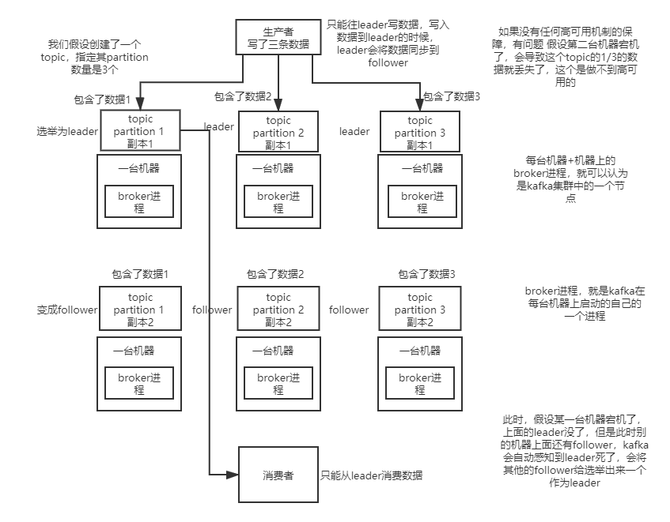
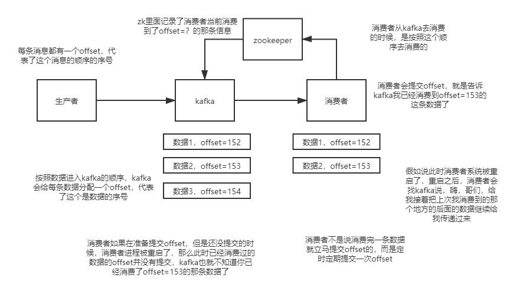
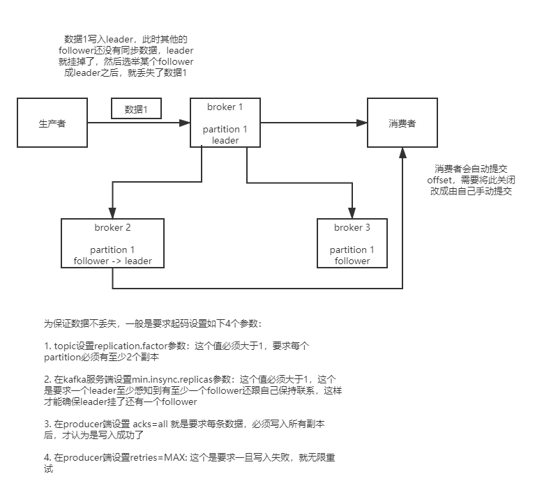
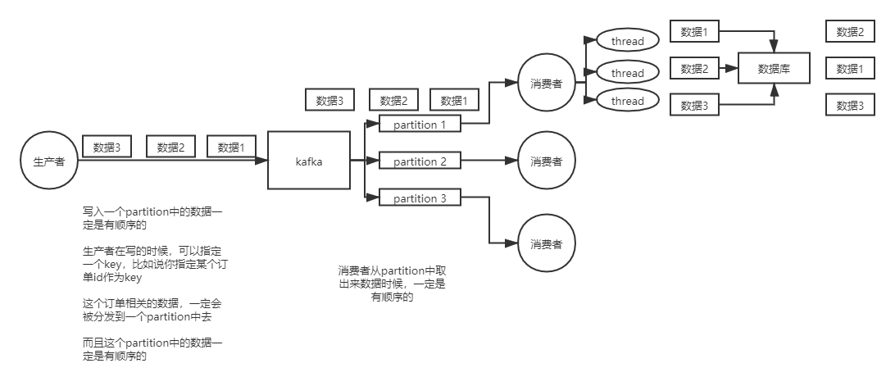
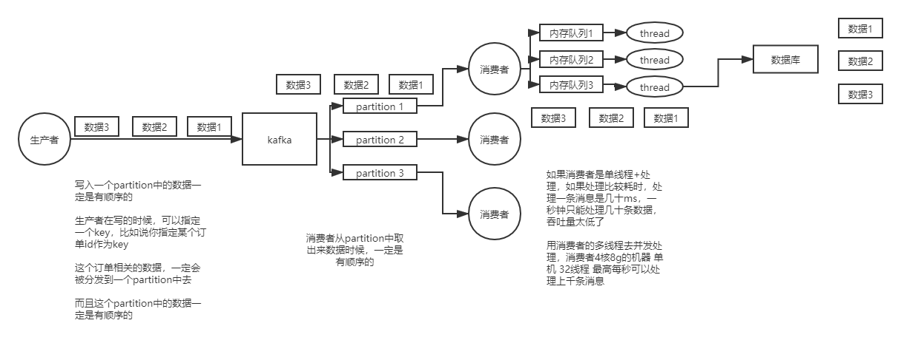

### kafka高可用

### 如何保证消息不被重复消费？如何保证消息消费的幂等性？

1. 比如拿个数据要写库，可以先根据主键查一下，无则插入，有则update
2. 记录最新消费的offset至内存或者redis中，入库之前先判断一下是否消费过
3. 基于数据库的主键唯一约束来保证不重复消费
 
### kafka可能存在的数据丢失

### kafka保证消息的顺序性？

### kafka复制的底层原理？

### kafka leader 的选举算法？

### kafka增加partition后的rebalance算法？

### 如何优化kafka的吞吐量？

### kafka 可以脱离 zookeeper 单独使用吗？为什么？

### kafka 有几种数据保留的策略？

### kafka 同时设置了 7 天和 10G 清除数据，到第五天的时候消息达到了 10G，这个时候 kafka 将如何处理？

### 什么情况会导致 kafka 运行变慢？

### 使用 kafka 集群需要注意什么？
