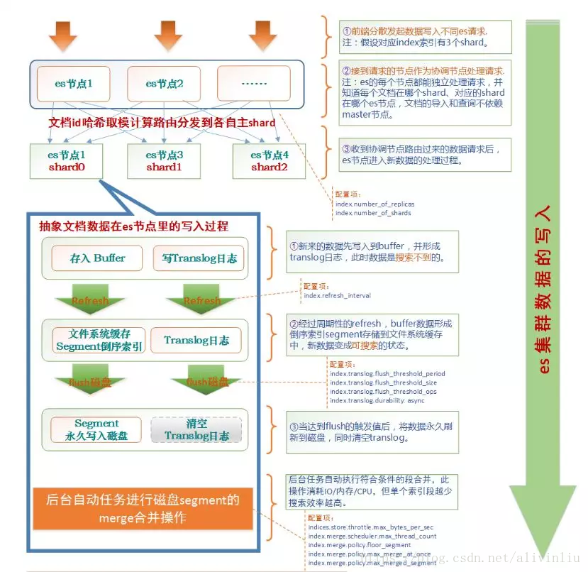
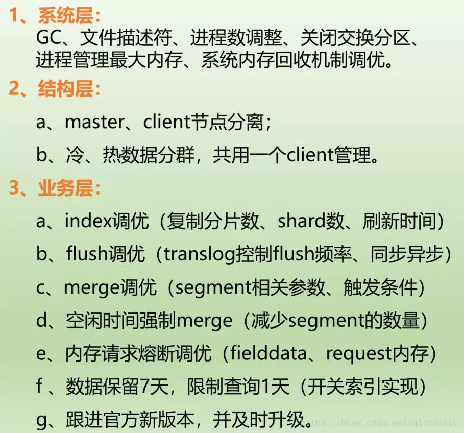

  - [背景](#1)
  - [上行数据写入](#2)
  - [下行数据读取](#3)
  - [es优化逻辑](#4)
  - [总结](#5)
<h3 id="1">背景</h3>
随着日志量的增加，es 集群需要不停的调整，结构层面的冷热数据分离、master 和 client 节点的分离，es 集群层面的 index 优化、flush 优化、merge 优化、内存熔断优化，系统层面的 GC、文件描述符、进程数、关闭交换分区调整等等。

其实 es 优化是一个法无定法的事儿，并不是死板的调固定参数，而是要不停的去试各种参数值在自己的业务场景下哪个表现最好，但是总结起来，首先了解了 es 的数据写入和读取过程，才知道如何下手，我们做的所有调优都是为了更快的索引速度、更快更大数据量的搜索性能、更稳定的服务。

下面从上下行的角度做个介绍。
<h3 id="2">上行数据写入</h3>
下图将生产环境里真实的写入过程进行完全的抽象并展现出来，es 里面有很多的概念，这个网上有很多介绍，不展开说。

从这张图看，首先数据的写入不依赖 master 节点，其实读取也是一样的，每一个节点都可以作为协调节点处理请求，并将数据路由到数据该有的节点，每个节点都可以查询到集群和文档的详细信息，那 master 的作用是什么呢？

es 集群 master 节点的作用是维护元信息和管理集群状态，master 节点只是维护元信息并不是所有元信息的存放点，它负责了删除和创建索引等系列操作，但数据的写入和数据的查询都不需要经过 master 节点的。

数据写入的整个过程如下：

**数据写入请求——> 协调节点接收后数据路由处理——> 存入对应数据节点的 index buffer 并记录 translog 日志——> 经过 refresh 刷新为 segment 存入文件缓存并变为可搜索——> 数据永久刷新到磁盘并清空 translog 日志**

到此一次数据就写完了，同时后台根据 merge 策略进行段的合并操作，在一个索引中，segment 越少，搜索效率越高，一个 shard 最小可以 merge 合并成一个 segment，segment 就是倒序索引。
<h3 id="3">下行数据读取</h3>
从整体上看，下行数据的搜索没有数据写入那么复杂，es 集群也是类似于 map reduce 的方式进行查询的，分层聚合计算，中间会有打分制等算法，最后在 client 节点做结果汇聚返回给客户端。

全过程大致是当客户端节点收到 search 请求后，计算出牵涉到的 shard 并将请求分发出去，收到请求的节点进行第一步的汇聚，然后将汇聚结果返回到 client 节点，client 节点再次处理后，将结果发给客户端。
<h3 id="4">es 集群优化逻辑</h3>

<h3 id="5">总结</h3>
知道了 es 的写入和查询原理后，就可以根据实际的业务场景做出调整，搭建过程可以进行分层次的调优，灵活处理线上问题。

转自 : https://mp.weixin.qq.com/s/_nhI-EEev9FJQhu7gcWdRQ
