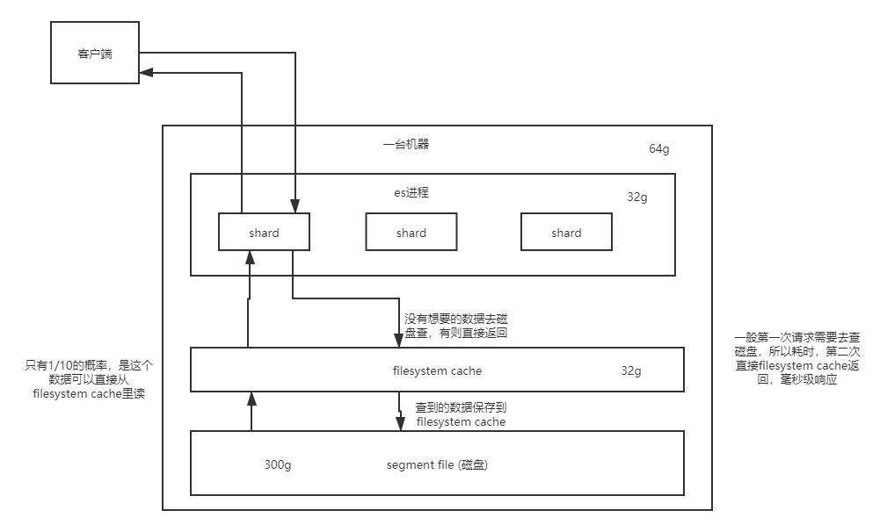

### lucene是什么？

### 倒排索引是什么？

### 全文搜索是什么？

### es的分布式架构原理？es是如何实现分布式的？

### es写入数据的工作原理是什么？es查询数据的工作原理是什么？

### es在数据量很大的情况下，如何提高查询效率？

可以从以下方面考虑性能优化:(可参考[elasticsearch原理分析.md](elasticsearch原理分析.md))

1. 合理规划es每个节点的segment file大小和filesystem cache大小的关系，一般segment file的大小略大于filesystem cache比较好。可以避免不必要的字段建立索引或者将其不被搜索的字段存入hbase/mysql中，只将需要搜索的字段存入es，通过es查询指定的数据，然后通过数据id去hbase/mysql获取数据
2. 数据预热(最好做一个专门预热的子系统，提前让数据进入filesystem cache中去)
3. 冷热分离(热数据和冷数据分别存入不同机器和不同index)，热数据的机器配置最好比冷数据机器配置好一点，冷数据搜索较慢，访问的用户少，影响不大
4. document模型设计。类似mysql的join操作，尽量不要使用es的关联查询，性能很低。最好入es的数据是join后的结果，数据冗余不可怕
5. 分页性能优化(深度分页，越深越慢),类似只能下拉分页，可以考虑使用scroll api实现。缺点：只能往下翻页，不支持跳页和往上翻页 [分页link](https://www.elastic.co/guide/cn/elasticsearch/guide/current/pagination.html)

### es生产集群的部署架构是什么？每个索引的数据量大概有多少？每个索引大概有多少个分片？

先3台, 6核64g，每个索引3个分片，每个分片大约30g的数据。后扩展至5台

### es的相关评分算法？(TF/IDF算法)

### deep paging

### 搜索优化？