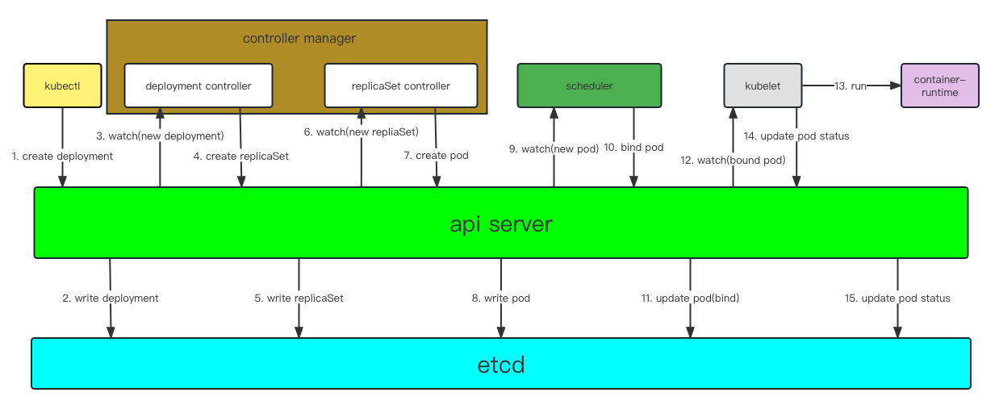

#### kubernetes包含几个组件。各个组件的功能是什么。组件之间是如何交互的。
- 控制平面组件:
  - kube-apiserver: 该组件负责公开了 Kubernetes API，负责处理接受请求的工作
  - etcd: 键值存储,用作 Kubernetes 的所有集群数据的后台数据库 (为什么要用etcd做数据库？）
  - kube-scheduler: 负责监视新创建的、未指定运行节点（node）的 Pods， 并选择节点来让 Pod 在上面运行
  - kube-controller-manager: 负责运行controller. node controller, job controller, deployment controller etc.

- Node组件:
  - kubelet: 它保证容器（containers）都运行在 Pod 中
  - kube-proxy: 是集群中每个节点（node）上所运行的网络代理, 维护节点上的一些网络规则， 这些网络规则会允许从集群内部或外部的网络会话与 Pod 进行网络通信。
  - container-runntime: 负责运行容器的软件。 containerd, docker etc.

控制面组件不会直接通信。都会通过api-server进行信息的交互。 而这些信息是通过watch机制拿到组件关心的信息做自己的逻辑处理。

#### 一个经典pod的完整生命周期。

- Pending：Pod已经被kubernetes接受，但一个或多个容器尚未设置并准备好运行。通常处在 Pod 的调度过程中。

- ContainerCreating：Pod 的调度完成，被分配到指定 Node 上。处于容器创建的过程中。通常是在拉取镜像的过程中。

- Running：Pod 包含的所有容器都已经成功创建，至少有一个容器仍在运行，或者正在启动或重启。

- Successed：Pod 中所有容器都成功结束，且不会被重启

- Failed：Pod 中所有容器都结束，但至少一个容器以失败状态结束。

- Unknown： 由于一些原因，Pod 的状态无法获取，通常是与 Pod 所在节点通信时出错导致。

#### k8s的pause容器有什么用。是否可以去掉。

#### k8s中的pod内几个容器之间的关系是什么。

#### k8s的service和ep是如何关联和相互影响的。

#### 详述kube-proxy的工作原理，一个请求是如何经过层层转发落到某个pod上的整个过程。请求可能来自pod也可能来自外部。

#### rc/rs功能是怎么实现的。

#### 详述从API接收到一个创建rc/rs的请求，到最终在节点上创建pod的全过程，尽可能详细。

#### 另外，当一个pod失效时，kubernetes是如何发现并重启另一个pod的？

#### deployment/rs有什么区别。其使用方式、使用条件和原理是什么。

#### cgroup中的cpu有哪几种限制方式。

#### k8s是如何使用实现request和limit的。