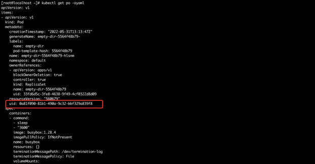
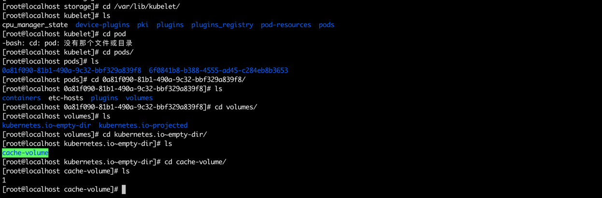

##### k8s集群版本
```
v1.21.1
```

##### emptyDir 配置事例
```
piVersion: apps/v1
kind: Deployment
metadata:
  name: empty-dir
spec:
  replicas: 1
  selector:
    matchLabels:
      name: empty-dir
  template:
    # 这里是 Pod 模版
    metadata:
      labels:
        name: empty-dir
    spec:
      containers:
      - name: busybox
        image: busybox:1.28.4
        volumeMounts:
        - mountPath: /cache
          name: cache-volume
        command: ["sleep","3600"]
      - name: nginx
        image: nginx:latest
        imagePullPolicy: IfNotPresent
        volumeMounts:
        - mountPath: /cache
          name: cache-volume
      volumes:
      - name: cache-volume
        emptyDir: {}
```

pod内两个容器的挂载目录共享, 增加副本数, 副本之间挂载目录不共享。

可以查看pod的uid



在对应的kubelet存储目录下可找到对应的empty-dir目录(以pod为维度)



https://v1-21.docs.kubernetes.io/zh/docs/concepts/storage/volumes/#emptydir

