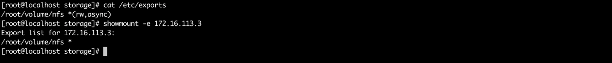

##### k8s集群版本
```
v1.21.1
```

##### 前言
```
本文介绍了两种方式挂载nfs存储
1. 直接挂载nfs
2. 通过pvc storageclass动态生成pv挂载nfs

```

在此之前需要先安装nfs 本文通过yum安装的nfs

nfs 配置



##### 直接挂载nfs 
```
apiVersion: apps/v1
kind: Deployment
metadata:
  name: nfs
spec:
  replicas: 1
  selector:
    matchLabels:
      name: nfs
  template:
    # 这里是 Pod 模版
    metadata:
      labels:
        name: nfs
    spec:
      containers:
      - name: busybox
        image: busybox:1.28.4
        volumeMounts:
        - mountPath: /nfs-volume/tmp1
          name: nfs-volume
          subPath: tmp1
        - mountPath: /nfs-volume/tmp2
          name: nfs-volume
          subPath: tmp2
        command: ["sleep","3600"]
      volumes:
      - name: nfs-volume
        nfs:
          # 宿主上目录位置
          path: /root/volume/nfs
          # 此字段为可选
          server: 172.16.113.3
```

尝试在tmp1目录添加一个文件 报没有权限


此情况 将tmp1目录设置为777无需重启pod即可解决

##### 通过pvc storageclass动态生成pv挂载nfs
由于每个 StorageClass 都有一个制备器（Provisioner）用来决定使用哪个卷插件制备 PV。 k8s没有nfs的内置provisioner,所以需要我们自己手动来部署provisioner

##### nfs-provisioner (基于已经存在的nfs server)
```
apiVersion: v1
kind: ServiceAccount
metadata:
  name: nfs-client-provisioner
  # replace with namespace where provisioner is deployed
  namespace: default
---
kind: ClusterRole
apiVersion: rbac.authorization.k8s.io/v1
metadata:
  name: nfs-client-provisioner-runner
rules:
  - apiGroups: [""]
    resources: ["nodes"]
    verbs: ["get", "list", "watch"]
  - apiGroups: [""]
    resources: ["persistentvolumes"]
    verbs: ["get", "list", "watch", "create", "delete"]
  - apiGroups: [""]
    resources: ["persistentvolumeclaims"]
    verbs: ["get", "list", "watch", "update"]
  - apiGroups: ["storage.k8s.io"]
    resources: ["storageclasses"]
    verbs: ["get", "list", "watch"]
  - apiGroups: [""]
    resources: ["events"]
    verbs: ["create", "update", "patch"]
---
kind: ClusterRoleBinding
apiVersion: rbac.authorization.k8s.io/v1
metadata:
  name: run-nfs-client-provisioner
subjects:
  - kind: ServiceAccount
    name: nfs-client-provisioner
    # replace with namespace where provisioner is deployed
    namespace: default
roleRef:
  kind: ClusterRole
  name: nfs-client-provisioner-runner
  apiGroup: rbac.authorization.k8s.io
---
kind: Role
apiVersion: rbac.authorization.k8s.io/v1
metadata:
  name: leader-locking-nfs-client-provisioner
  # replace with namespace where provisioner is deployed
  namespace: default
rules:
  - apiGroups: [""]
    resources: ["endpoints"]
    verbs: ["get", "list", "watch", "create", "update", "patch"]
---
kind: RoleBinding
apiVersion: rbac.authorization.k8s.io/v1
metadata:
  name: leader-locking-nfs-client-provisioner
  # replace with namespace where provisioner is deployed
  namespace: default
subjects:
  - kind: ServiceAccount
    name: nfs-client-provisioner
    # replace with namespace where provisioner is deployed
    namespace: default
roleRef:
  kind: Role
  name: leader-locking-nfs-client-provisioner
  apiGroup: rbac.authorization.k8s.io
---
kind: Deployment
apiVersion: apps/v1
metadata:
  name: nfs-client-provisioner
spec:
  replicas: 1
  selector:
    matchLabels:
      app: nfs-client-provisioner
  strategy:
    type: Recreate
  template:
    metadata:
      labels:
        app: nfs-client-provisioner
    spec:
      serviceAccountName: nfs-client-provisioner
      containers:
        - name: nfs-client-provisioner
          image: registry.cn-beijing.aliyuncs.com/programmingroad/nfs-subdir-external-provisioner:v4.0.2
          volumeMounts:
            - name: nfs-client-root
              mountPath: /persistentvolumes
          env:
            - name: PROVISIONER_NAME
              value: k8s-sigs.io/nfs-subdir-external-provisioner
            - name: NFS_SERVER
              value: 172.16.113.3
            - name: NFS_PATH
              value: /root/volume/nfs
      volumes:
        - name: nfs-client-root
          nfs:
            server: 172.16.113.3
            path: /root/volume/nfs
```

部署完provisioner之后 需要部署 sc

##### nfs-class
```
apiVersion: storage.k8s.io/v1
kind: StorageClass
metadata:
  name: nfs-client
provisioner: k8s-sigs.io/nfs-subdir-external-provisioner # or choose another name, must match deployment's env PROVISIONER_NAME'
parameters:
  pathPattern: "${.PVC.namespace}/${.PVC.annotations.nfs.io/storage-path}" # waits for nfs.io/storage-path annotation, if not specified will accept as empty string.
  onDelete: delete
```

##### test-claim.yaml
```
kind: PersistentVolumeClaim
apiVersion: v1
metadata:
  name: test-claim
spec:
  storageClassName: nfs-client
  accessModes:
    - ReadWriteMany
  resources:
    requests:
      storage: 1Mi
```


##### test-pod.yaml
```
apiVersion: storage.k8s.io/v1
kind: StorageClass
metadata:
  name: nfs-client
provisioner: k8s-sigs.io/nfs-subdir-external-provisioner # or choose another name, must match deployment's env PROVISIONER_NAME'
parameters:
  pathPattern: "${.PVC.namespace}/${.PVC.annotations.nfs.io/storage-path}" # waits for nfs.io/storage-path annotation, if not specified will accept as empty string.
  onDelete: delete
[root@localhost storage]# cat test-claim.yaml
kind: PersistentVolumeClaim
apiVersion: v1
metadata:
  name: test-claim
spec:
  storageClassName: nfs-client
  accessModes:
    - ReadWriteMany
  resources:
    requests:
      storage: 1Mi
[root@localhost storage]# cat test-pod.yaml
kind: Pod
apiVersion: v1
metadata:
  name: test-pod
spec:
  containers:
  - name: test-pod
    image: busybox:stable
    command:
      - "/bin/sh"
    args:
      - "-c"
      - "touch /mnt/SUCCESS && exit 0 || exit 1"
    volumeMounts:
      - name: nfs-pvc
        mountPath: "/mnt"
  restartPolicy: "Never"
  volumes:
    - name: nfs-pvc
      persistentVolumeClaim:
        claimName: test-claim
```
在挂载目录下存在SUCCESS文件即成功. 如遇到没有权限问题 修改对应目录权限即可

https://v1-21.docs.kubernetes.io/zh/docs/concepts/storage/storage-classes/

https://github.com/kubernetes-sigs/nfs-subdir-external-provisioner