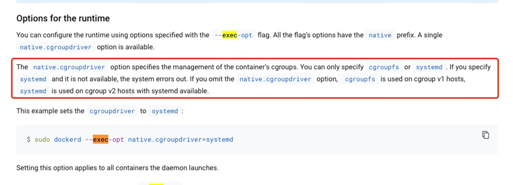
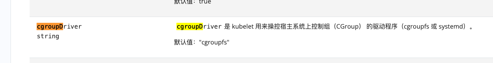
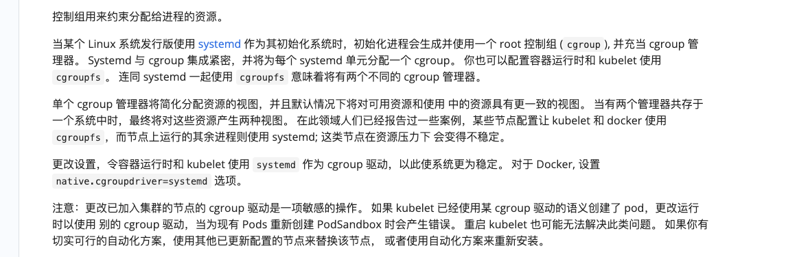

#### 默认docker和kubelet的cgroup驱动是cgroupfs


https://docs.docker.com/engine/reference/commandline/dockerd/#daemon-configuration-file


https://kubernetes.io/zh-cn/docs/reference/config-api/kubelet-config.v1beta1/#kubelet-config-k8s-io-v1beta1-KubeletConfiguration

#### 由于使用默认的cgroupfs, 连同 systemd 一起使用 cgroupfs 意味着将有两个不同的 cgroup 管理器.这类节点在资源压力下 会变得不稳定. 所以要将cgroupsfs -> systemd

https://v1-23.docs.kubernetes.io/zh/docs/setup/production-environment/container-runtimes/

#### 配置docker和kubelet使用systemd来管理容器的cgroup
```

修改docker daemon.json
vi /etc/docker/daemon.json


{
  "exec-opts": ["native.cgroupdriver=systemd"],
  "log-driver": "json-file",
  "log-opts": {
    "max-size": "100m"
  },
  "storage-driver": "overlay2"
}

修改kubelet的命令行参数
添加
--cgroup-driver=systemd

```


#### FAQ

kubelet和容器运行时的cgroup管理器不一致时会导致kubelet起不来


