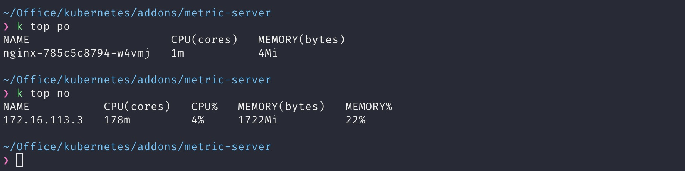
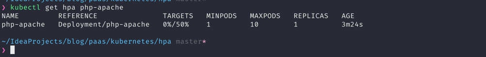
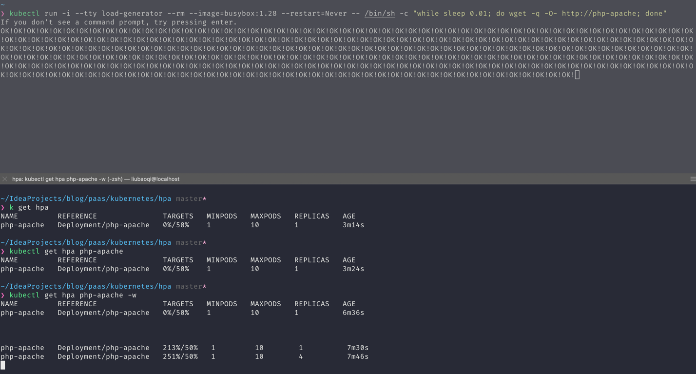
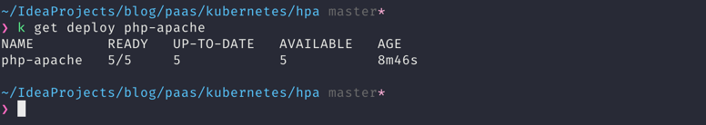
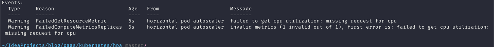
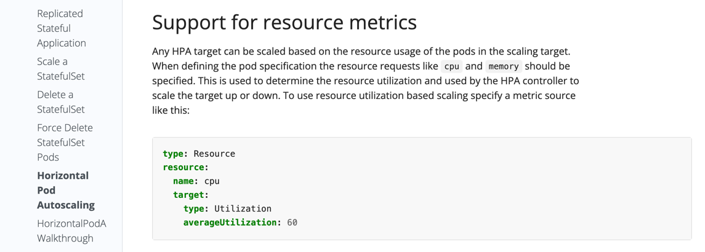

- ### [要求](#要求-1)
- ### [安装](#安装-1)
- ### [验证安装是否成功](#验证安装是否成功-1)
- ### [运行 php-apache 服务器并暴露服务](#运行-php-apache-服务器并暴露服务-1)
- ### [创建hpa](#创建hpa-1)
- ### [查看hpa当前状态](#查看hpa当前状态-1)
- ### [增加负载](#增加负载-1)
- ### [停止产生负载](#停止产生负载-1)
- ### [FAQ](#faq-1)


### 要求
- kube-apiserver 必须启用[aggregation layer](https://v1-23.docs.kubernetes.io/zh/docs/tasks/extend-kubernetes/configure-aggregation-layer/)
- 节点必须启用 Webhook [authentication and authorization](https://kubernetes.io/zh-cn/docs/reference/access-authn-authz/kubelet-authn-authz/)
- Kubelet 证书需要由集群证书颁发机构签名（或通过将 --kubelet-insecure-tls 传递给 Metrics Server 来禁用证书验证）
- container runtime 必须实现[container metrics RPC](https://github.com/kubernetes/community/blob/master/contributors/devel/sig-node/cri-container-stats.md)（或具有 [cAdvisor](https://github.com/google/cadvisor) 支持）
- 网络应支持以下通信：
	- control plane 到 metric server。control plane 节点需要到达 Metrics Server 的 pod IP 和端口 10250（如果启用了 hostNetwork，则需要到达节点 IP 和自定义端口）。阅读有关 [control plane 到节点通信的更多信息](https://kubernetes.io/docs/concepts/architecture/control-plane-node-communication/#control-plane-to-node)
	- metric server 到 所有节点的kubelet. metric server 需要到达节点地址和 kubelet 端口.地址和端口在kubelet中配置并作为node对象的一部分发布。.status.addresses中地址和.status.daemonEndpoints.kubeletEndpoint.port 字段中的端口（默认 10250）Metrics Server 将根据kubelet-preferred-address-types命令行标志（清单中的默认InternalIP、ExternalIP、Hostname）提供的列表选择第一个节点地址.

### 安装
```
rbac:

kubectl apply -f ./metric-server/metrics-server-rbac.yaml

non-rbac:

kubectl apply -f ./metric-server/metrics-server-non-rbac.yaml
```


### 验证安装是否成功



### 运行 php-apache 服务器并暴露服务

```
kubectl apply -f ./metric-server/php-apache.yaml
```


### 创建hpa
```
kubectl autoscale deployment php-apache --cpu-percent=50 --min=1 --max=10
```


### 查看hpa当前状态
```
kubectl get hpa php-apache
```

target 采集到指标表示hpa已经正常工作




### 增加负载

增加负载 watch hpa状态 查看副本数:
```
kubectl run -i --tty load-generator --rm --image=busybox:1.28 --restart=Never -- /bin/sh -c "while sleep 0.01; do wget -q -O- http://php-apache; done"

kubectl get hpa php-apache -w

kubectl get deploy php-apache
```





### 停止产生负载
```
Ctrl + c
```

过一段时间HPA 会自动将副本数缩减为 1。


### FAQ
1. 监控的workload没有设置 requests 并且设置hpa基于利用率(utilization)的扩缩




