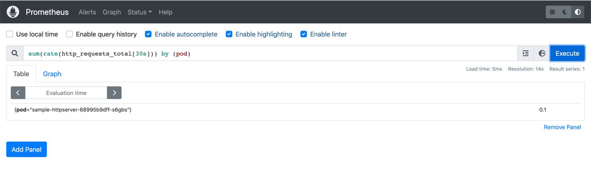

### 示例应用

准备一个简单的 web 应用，可以记录请求次数并通过 /metrics 端点输出 Prometheus 格式的指标 http_requests_total

```
func main() {
	metrics := prometheus.NewCounterVec(
		prometheus.CounterOpts{
			Name:        "http_requests_total",
			Help:        "Number of total http requests",
		},
		[]string{"status"},
	)
	prometheus.MustRegister(metrics)

	http.HandleFunc("/", func(w http.ResponseWriter, r *http.Request) {
		path := r.URL.Path
		statusCode := 200
		switch path {
		case "/metrics":
			promhttp.Handler().ServeHTTP(w, r)
		default:
			w.WriteHeader(statusCode)
			w.Write([]byte("Hello World!"))
		}
		metrics.WithLabelValues(strconv.Itoa(statusCode)).Inc()
	})
	http.ListenAndServe(":3000", nil)
}
```
将应用部署到集群：
```
kubectl apply -f ./custom-metric-server/sample-httpserver-deployment.yaml
```

### 安装Prometheus

使用 Helm 安装 Prometheus，先添加 prometheus 的 chart 仓库：

```
helm repo add prometheus-community https://prometheus-community.github.io/helm-charts
```

这里的测试只需要用到 prometheus-server，安装时禁用其他组件。同时为了演示效果的实效性，将指标的拉取间隔设置为 10s。
```
# install prometheus with some components disabled
# set scrape interval to 10s
helm install prometheus prometheus-community/prometheus --version=15.18.0 -n default --set alertmanager.enabled=false,pushgateway.enabled=false,nodeExporter.enabled=false,kubeStateMetrics.enabled=false,server.persistentVolume.enabled=false,server.global.scrape_interval=10s,server.service.type=NodePort
```


上述已将prometheus svc的端口以NodePort的形式暴露，可以通过NodePort在浏览器中访问 web 页面。

这里查询 Pod 的 RPS 使用 sum(rate(http_requests_total[30s])) by (pod) 语句查询：




### 安装Prometheus-adapter

```
helm install prometheus-adapter prometheus-community/prometheus-adapter-3.4.2.tgz -n default -f kubernetes/values-adapter.yaml
```

除了要配置 Prometheus server 的访问方式外，还要配置自定义指标的计算规则，告诉 adapter 如何从 Prometheus 获取指标并计算出我们需要的指标：

```
rules:
  default: false
  custom:
   - seriesQuery: '{__name__=~"^http_requests.*_total$",container!="POD",namespace!="",pod!=""}'
     resources:
       overrides:
         namespace: { resource: "namespace" }
         pod: { resource: "pod" }
     name:
       matches: "(.*)_total"
       as: "${1}_qps"
     metricsQuery: sum(rate(<<.Series>>{<<.LabelMatchers>>}[30s])) by (<<.GroupBy>>)
```

可以参考详细的 [Adapter 配置](https://github.com/kubernetes-sigs/prometheus-adapter/blob/master/docs/sample-config.yaml)。

待 promethues-adapter pod 成功运行后，可以执行 custom.metrics.k8s.io 请求：


注意：这里的 value: 100m，值的后缀“m” 标识 milli-requests per seconds，所以这里的 100m 的意思是 0.1/s 每秒0.1 个请求。