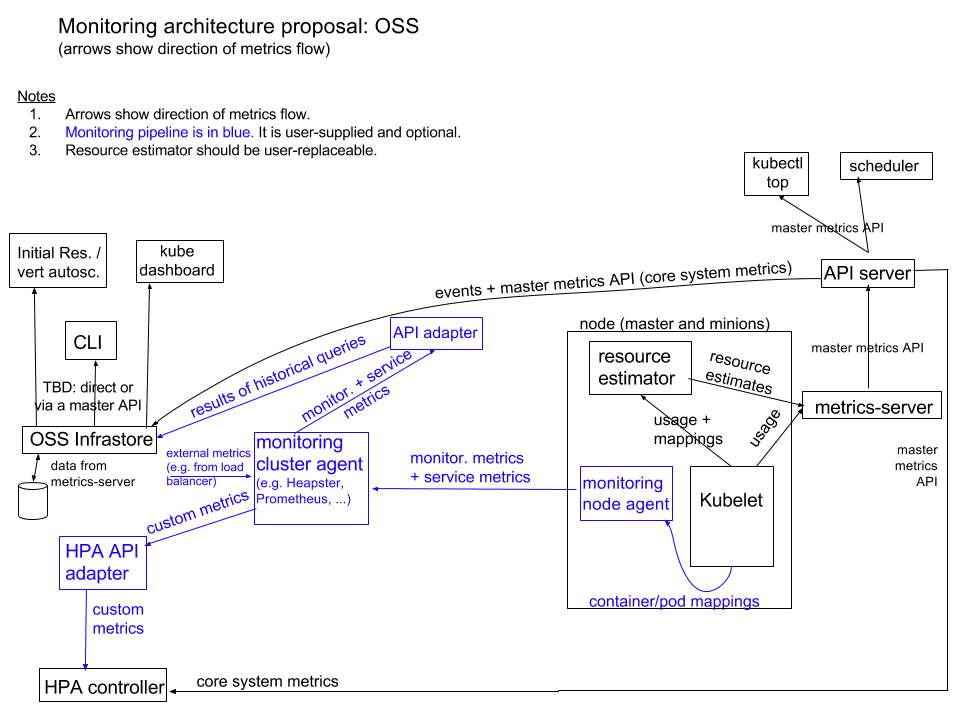

>若无特殊说明本文档中涉及的k8s版本均为 v1.23.6

#### 架构图

#### 对 Metrics API 的支持

默认情况下，hpa controller 会从一系列的 API 中检索度量值。 集群管理员需要确保下述条件，以保证 hpa controller 能够访问这些 API：

- 启用了 [API aggregation layer](https://v1-23.docs.kubernetes.io/zh/docs/tasks/extend-kubernetes/configure-aggregation-layer/)

- 相应的 API 已注册:
	- 对于resource metrics，将使用 metrics.k8s.io API，一般由 [metrics-server](https://github.com/kubernetes-incubator/metrics-server) 或者 [prometheus-adapter](https://github.com/kubernetes-sigs/prometheus-adapter) 提供。具体demo见 [metric-server-demo](./metric-server-demo.md)
	- 对于custom metrics/external metrics，将使用 custom.metrics.k8s.io/external.metrics.k8s.io API，一般由 [prometheus-adapter](https://github.com/kubernetes-sigs/prometheus-adapter) 提供。具体demo见 [prometheus-adapter-demo](./prometheus-adapter-demo.md)

相关链接: [资源指标管道](https://v1-23.docs.kubernetes.io/zh/docs/tasks/debug/debug-cluster/resource-metrics-pipeline/)
         [资源监控工具](https://v1-23.docs.kubernetes.io/zh/docs/tasks/debug/debug-cluster/resource-usage-monitoring/)