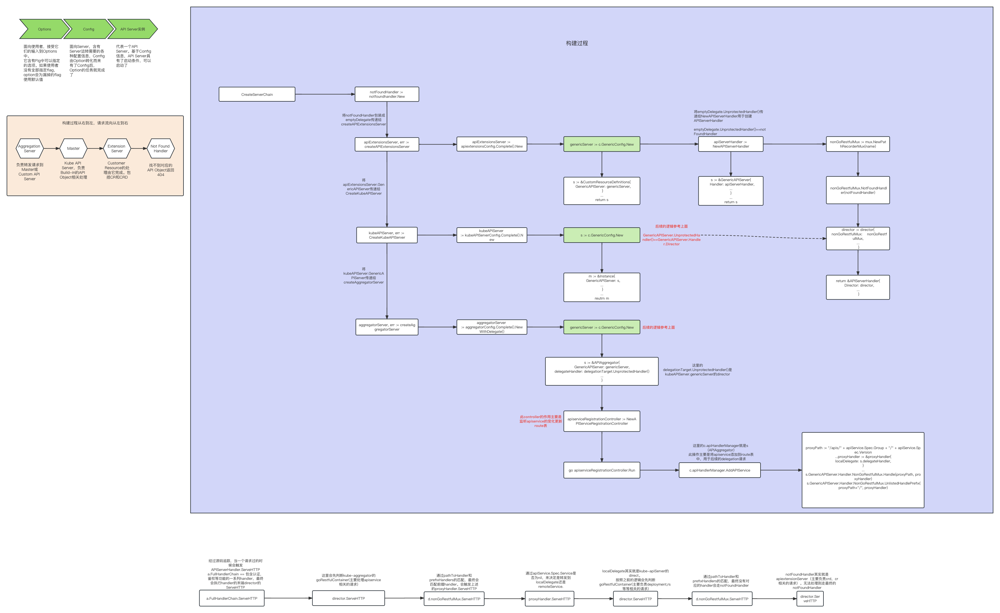
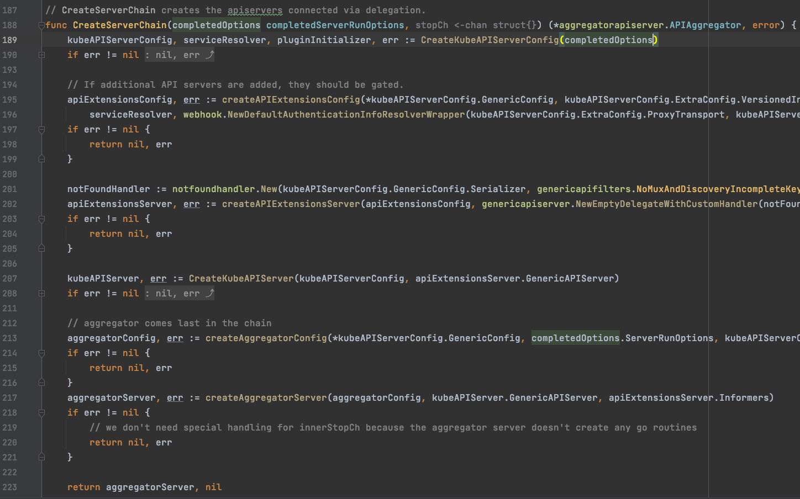
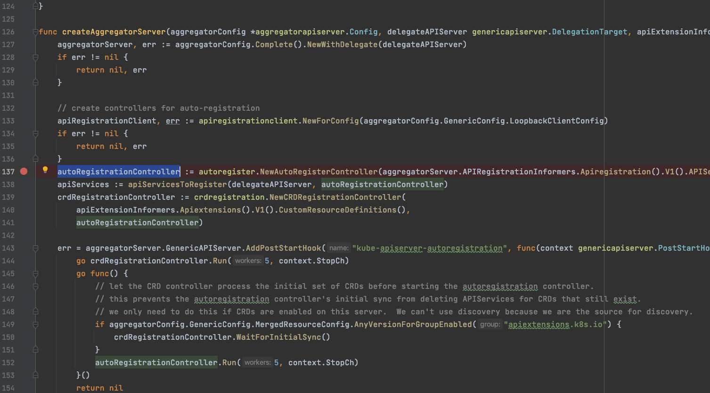
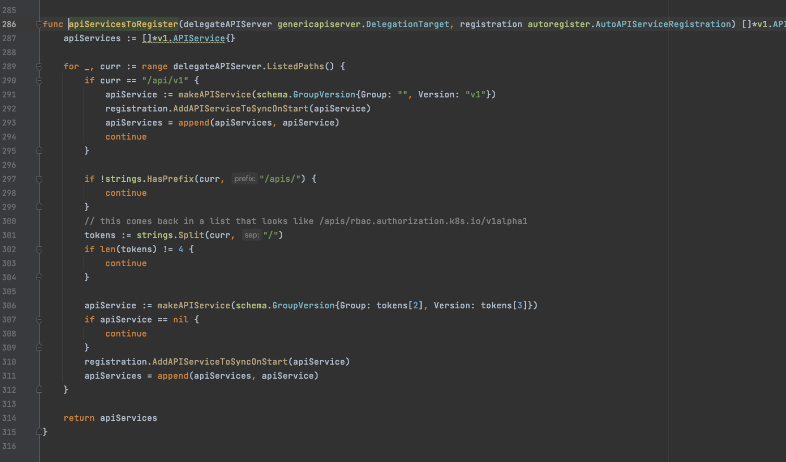
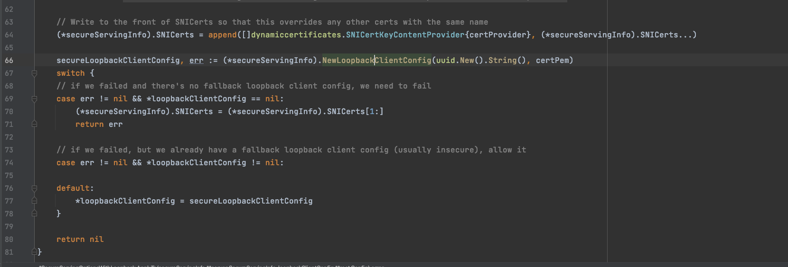

### 前述
最近阅读apiserver源码，尝试过各种方式追踪记录方便后续的回忆。之前尝试过画流程图的方式，发现画了一部分然后再修改的话很困难。牵一发动全身那。流程图的话也不好完全跟踪自己的思路想到哪记到哪。总体来说不够灵活。最终还是选择blog的方式记录结合流程图整体理解。本blog按照个人思路，想到哪记到哪。思路可能分散。大致弄懂后，有时间的话，可以结合全局重新梳理一下。接下来进入正题，分析下apiserver的链式调用是如何实现的。先贴一下之前画的图供整体理解

### 知识点预习

apiserver里面实际分为四个子server。分别为AggregatorServer, KubeAPIServer, APIExtensionsServer, notFoundHandler。我们所说的apiserver其实就是这四个子server串成一条链提供服务。这四个子server的构建过程是 notFoundHandler -> APIExtensionsServer -> KubeAPIServer -> AggregatorServer。而请求的过程则是反过来。进来的请求先交由AggregatorServer进行处理判断是自己处理还是转发请求。依次经过KubeAPIServer,APIExtensionsServer。如果上述三个server都无法处理，则进入notFoundHandler简单介绍下这四个server的作用。

- AggregatorServer: 作为请求的第一环，主要负责分发请求。除了apiservice的请求自己处理外，其他则转发给对应的server处理。这里的转发大致分为两条目的地。1是kubeAPIServer 2是通过apiservice注入的remote server。如何区分是转发到kubeAPiserver还是remove server主要是基于apiserver的spec.service的设置，为nil则转发给kubeApiserver。

- KubeAPIServer: 作为请求的次环，针对由AggregatorServer委派过来的请求，判断是否需要自己处理, kubeApiserver主要处理deployment, rs, sts, pod等内置的资源。如果非内置资源，比如crd或者cr。则交由下一环处理。

- APIExtensionsServer: 作为请求的第三环。主要处理crd和cr的相关请求。

- notFoundHandler: 最为请求的最后一环，主要针对无法处理的请求返回404。

接下来再进一步分析:

### 构建过程

经过源码追踪，创建serverChain的入口为CreateServerChain方法。

通过上图可以清晰的看出 options -> config -> server的构建。首先我们可以看到line:201notFoundHandler的创建。以及line:202APIExtensionsServer，line:207kubeAPIServer，line:217AggregatorServer按照顺序创建。由于子server都是基于genericServer实现的。所以APIExtensionsServer和kubeAPIServer差不多都是一样的，都是先创建genericServer。然后基于genericServer填充自己的内容。AggregatorServer有点区别，已知所有的资源(eg: crd，cr，deployment etc. aggregatorServer的apiservice除外)都会有对应的apiservice。这里就会引发出一个疑问，APIExtensionsServer和kubeAPIServer的构建是在aggregatorServer的前面，它们相关的apiservice是如何被aggregatorServer感知到并管理的？带着这个疑问，终于找到了对应的代码

通过上图我们可以看到line:138的apiServicesToRegister。这个apiServicesToRegister就是完成crd，deployment的初次注入apiservice具体实现我们进入看一下。

通过line:289我们可以看到其实是通过delegateAPIServer.ListedPaths()进行初始化的。这个delegateAPIServer其实就是kubeAPIServer.genericAPIServer。那么其ListedPaths()是如何拿到APIExtensionsServer.genericAPIServer的ListedPaths()的呢。通过追踪可以看到再创建genericServer的时候会进行相关的处理如下图:

答案基本清楚了。

看源码过程中，发现apiserver会调用自身的接口拿一些资源，那么是如何做到的呢？ 以及是如何认证和鉴权的呢？

我们可以看到调用自身接口的逻辑都是在postStartHook里面实现，顾名思义就是等server启动后做一些后续处理。 server已经启动了，自然就可以调用自身接口

那么是如何进行认证和鉴权的呢？

就拿上述的autoRegistrationController来说。该controller的Run会调用自身获取apiservice列表。而使用的client是apiRegistrationClient。这个apiRegistrationClient是通过aggregatorConfig.GenericConfig.LoopbackClientConfig进行创建的。

通过上面创建genericConfig过程中赋值的。 line:66我们可以看到创建loopbackClientConfig其实就是为BearerToken赋值了一个uid。

那么apiserver是如何验证这个uid的呢？

在genericConfig.complete中的AuthorizeClientBearerToken方法，会将上述uid转换成authenticator和authorizer包装在循环认证逻辑中，从而进行认证和鉴权。

### 请求过程